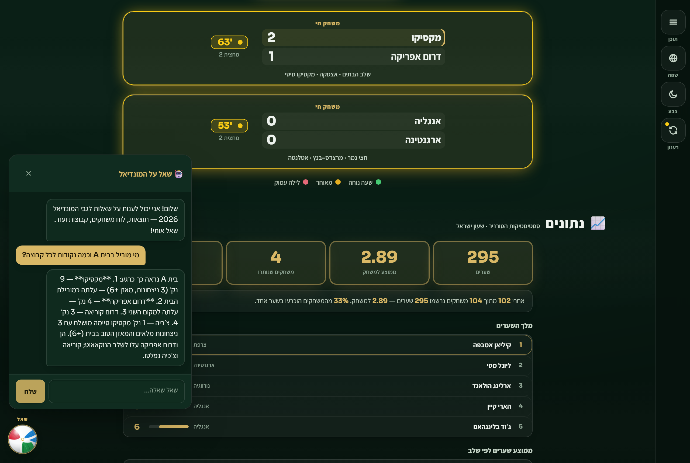
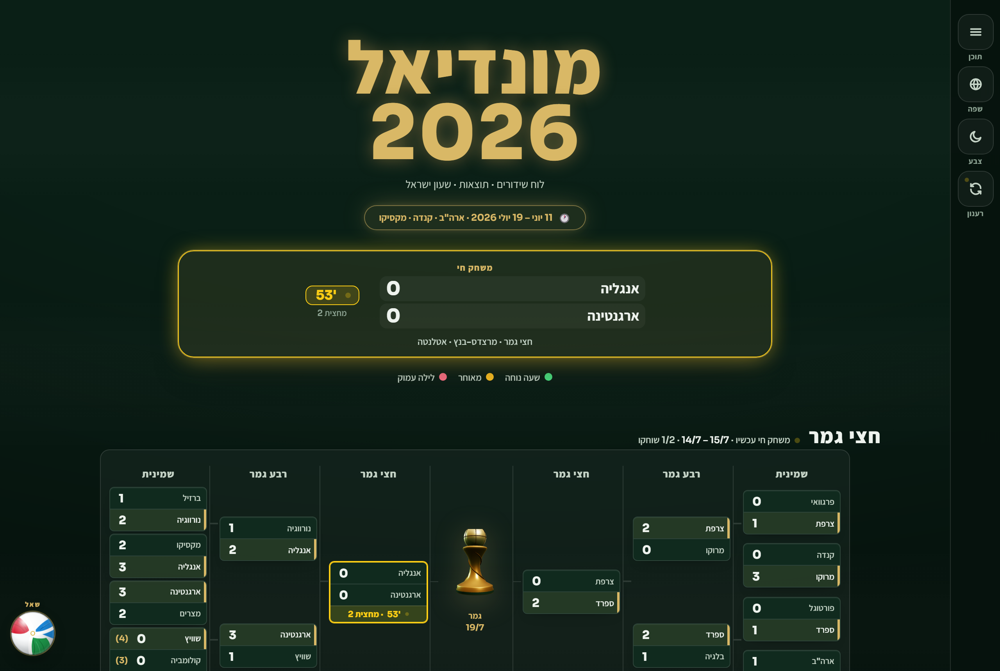
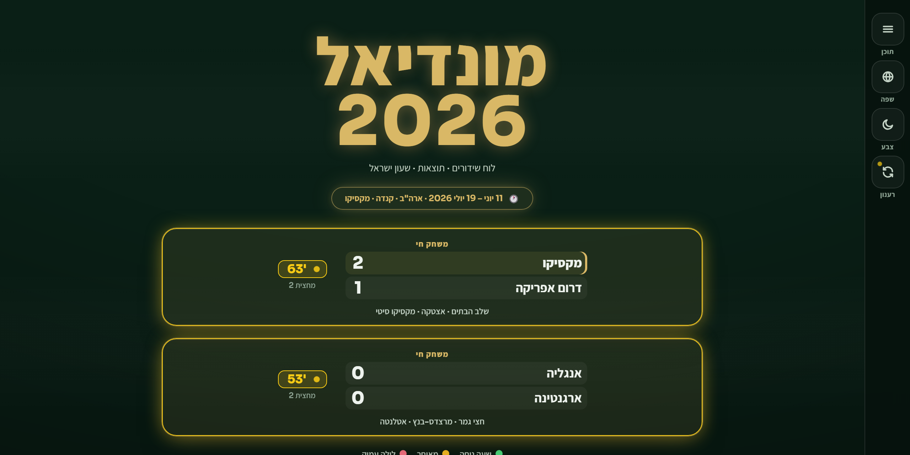
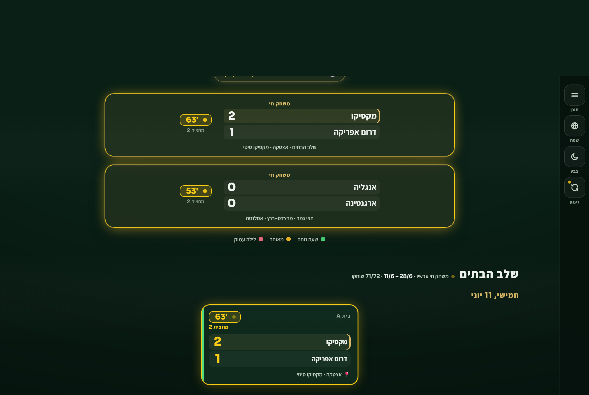
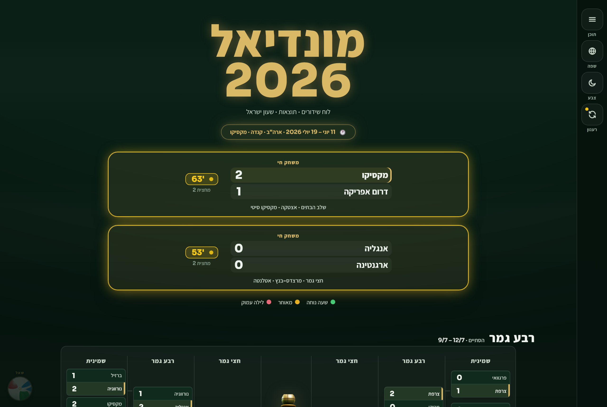
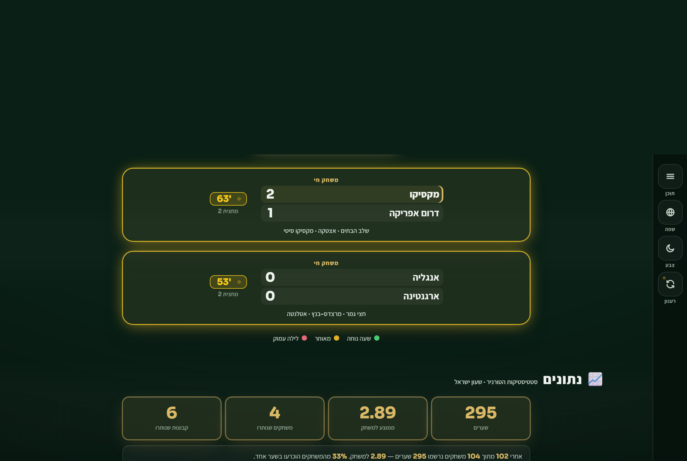
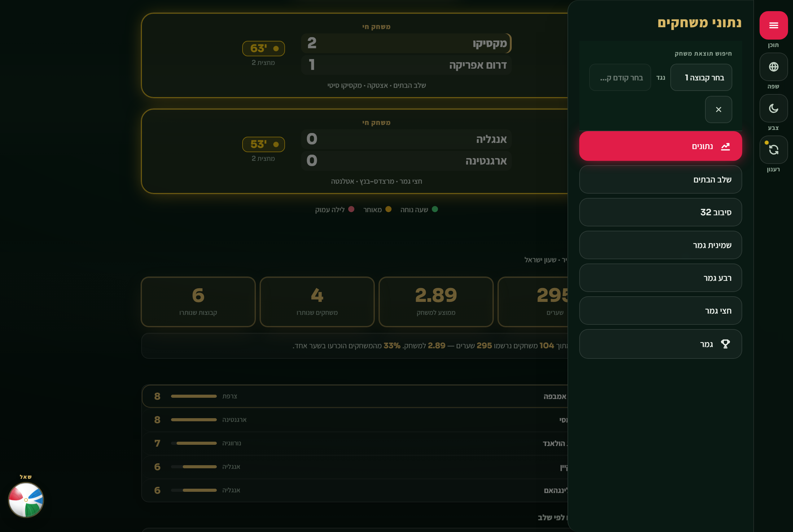
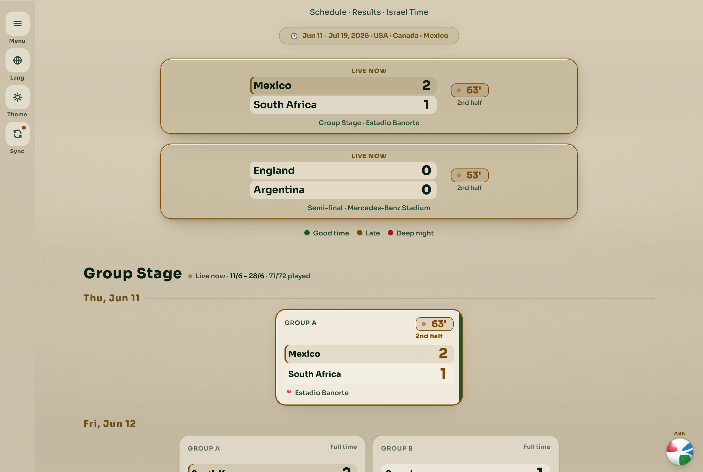
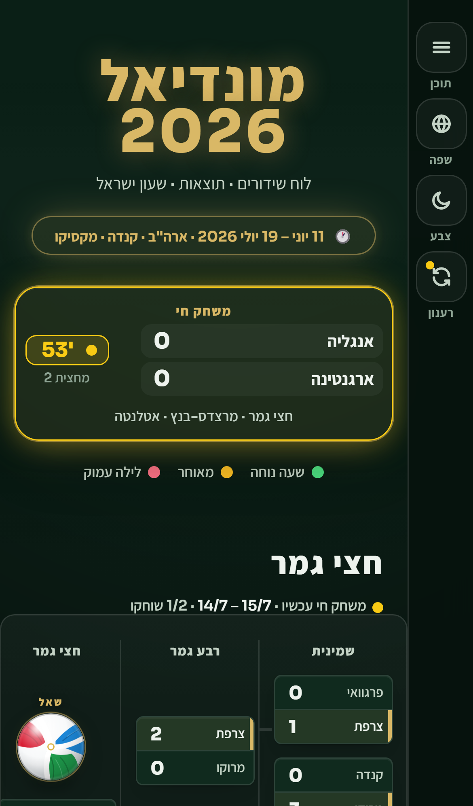
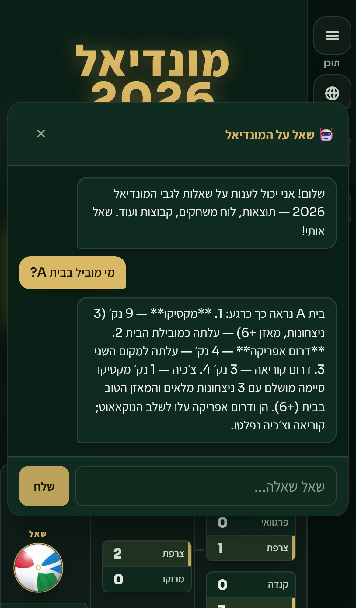

# 🏆 World Cup 2026 — Broadcast Schedule

> A free, open-source broadcast guide for the **2026 FIFA World Cup** — built for Israeli fans who want to know exactly when to watch, without staying up until 4am by mistake.

**🌐 Live site:** _coming soon via GitHub Pages_

---

## What is this?

This is a single HTML page that shows the full World Cup 2026 schedule in **Israel time (UTC+3)** — so you always know the real local kickoff time, not the US time listed on most sites.

Every match is color-coded by how friendly the hour is:

| Color | Meaning |
|---|---|
| 🟢 Green | Good hour — reasonable to watch live |
| 🟠 Orange | Late night — worth it for a big game |
| 🔴 Red | Deep night (2:00–6:00 AM) — set an alarm or catch the highlights |

There's also a hand-picked **⭐ Top Picks** list — the matches most worth staying up for, based on importance and storylines.

---

## Features

- **🤖 AI chatbot** — ask anything about the tournament in Hebrew or English. It answers from the live feed: standings, results, top scorers, who advanced, tournament totals — grounded in real data, not guesses.
- **🔴 Live match tracking** — scores, the running minute, and the match phase update on their own while a game is on, straight from the ESPN feed.
- **Full schedule** — all 104 matches: group stage, round of 32, knockouts, and the final
- **Knockout bracket** — the full tree with a 3D trophy, wired from the real results
- **Israel time** — every kickoff converted to UTC+3
- **Color-coded sleep guide** — instantly see if a match is worth watching live
- **Group standings** — live table for all 12 groups
- **Head-to-head search** — pick any two teams that met and see the result
- **Stats tab** — goals, average per match, top scorers, shootouts, cards, and more
- **Hebrew & English** — toggle language at any time, full RTL/LTR support
- **Dark & Light theme** — smooth animated switch
- **Mobile friendly** — fully responsive on any screen size

---

## 📸 Screenshots

> Real ESPN data drives the site. In the two shots below the chat reply is a representative example and a live match is shown for illustration — everything else is the live feed.

### 🤖 AI chatbot + 🔴 live tracking
The assistant reads the group table and answers with real numbers, while two matches run live at the top — the site's two headline features in one view.

### Home — hero, live match, and the knockout bracket

### Live match banner

### Group stage

### Knockout bracket

### Stats tab

### Head-to-head search

### Light theme + English

### Mobile
| Home | Chat |
|---|---|
|  |  |

---

## How to use

**Option 1 — Online (GitHub Pages)**  
Visit the live link above. No install needed.

**Option 2 — Local**  
Download `index.html`, open it in any browser. That's it.

---

## About the tournament

The **2026 FIFA World Cup** is the first edition with **48 teams** (expanded from 32), hosted across three countries:

- 🇺🇸 **USA** — 11 host cities including New York, Los Angeles, Dallas, Miami
- 🇨🇦 **Canada** — Toronto, Vancouver
- 🇲🇽 **Mexico** — Mexico City, Guadalajara, Monterrey

**Dates:** June 11 – July 19, 2026  
**Final:** MetLife Stadium, East Rutherford, New Jersey  
**Teams:** 48 nations, 12 groups of 4, then a new round of 32

The time zone difference from Israel (UTC+3) to US East Coast (UTC-4) is **7 hours** — meaning a 3:00 PM ET kickoff is 10:00 PM in Israel, and a 9:00 PM ET game is 4:00 AM. This page handles all that math for you.

---

## Tech

Built with zero dependencies — just one HTML file with embedded CSS and JavaScript.

| | |
|---|---|
| Markup | HTML5 |
| Styling | CSS custom properties, no framework |
| Logic | Vanilla JavaScript |
| Fonts | Google Fonts (Bebas Neue + Inter) |
| Hosting | GitHub Pages |

No React, no npm, no build step. Clone it, open it, done.

---

## Contributing

Found a wrong score, missing match, or want to add a feature?

1. Fork the repo
2. Edit `index.html`
3. Open a pull request with a short description of the change

All contributions welcome — especially score updates as the tournament progresses.

---

## Roadmap

- [ ] Auto-highlight today's matches on page load
- [ ] Countdown timer to the next match
- [ ] PWA support — installable on phone, works fully offline
- [ ] Score entry mode for live result tracking

---

*Made with ⚽ for Israeli football fans — 2026 World Cup · USA · Canada · Mexico*
